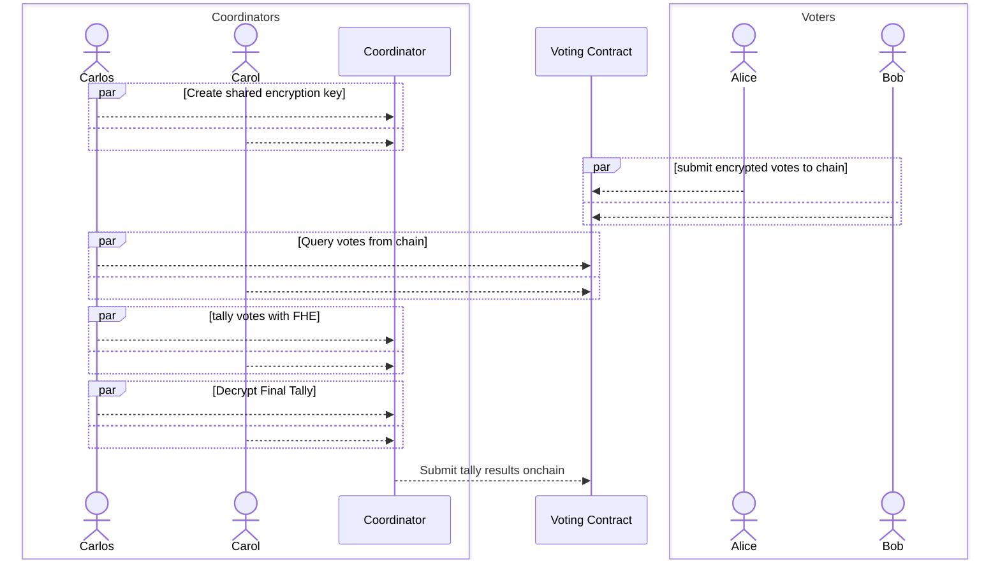

```mermaid
sequenceDiagram
    box Coordinators
        actor Carlos
        actor Carol
        participant Coordinator
    end

    participant Voting Contract

    box Voters
        actor Alice
        actor Bob
    end

    par Create shared encryption key
        Carlos -->> Coordinator: 
    and
        Carol -->> Coordinator: 
    end 


    par submit encrypted votes to chain
        Alice -->> Voting Contract: 
    and
        Bob -->> Voting Contract: 
    end

    par Query votes from chain
        Carlos -->> Voting Contract: 
    and
        Carol -->> Voting Contract: 
    end

    par tally votes with FHE
        Carlos -->> Coordinator: 
    and
        Carol -->> Coordinator: 
    end

    par Decrypt Final Tally
        Carlos -->> Coordinator: 
    and
        Carol -->> Coordinator: 
    end

    Coordinator -->> Voting Contract: Submit tally results onchain
```